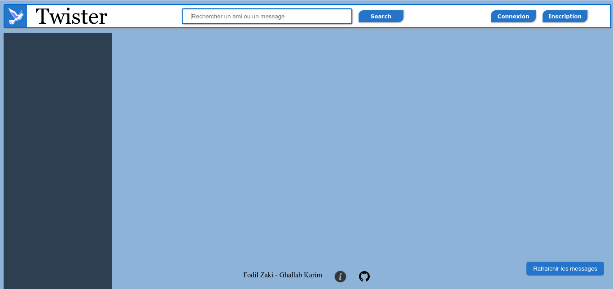

# Projet de L3 à l'UPMC - Twister

Ce projet réalisé dans le cadre du cours de "Technologies du Web" consiste en la réalisation d'un réseau social de type "Twitter" basé sur une API REST

## Composants du projet
### Partie Serveur

La programmation du serveur s'est faite avec JEE et les tests ont été efféctués sur un serveur Tomcat 9

### Partie Client

La partie client du site à été réalisée avec HTML5/CSS3 et JavaScript

## Un apercu de la page principal avant de nous quitter

## Authors

* **Zaki Fodil** (https://github.com/ZakiFodil)
* **Karim Ghallab** (https://github.com/PaulMorgon)
